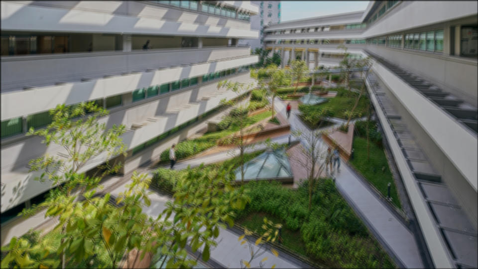

# Blur filter

This does what you think it does. A basic [box blur](https://en.wikipedia.org/wiki/Box_blur) works by taking the average value of adjacent pixels. A [gaussian blur](https://en.wikipedia.org/wiki/Gaussian_blur) works the same way but factors in weight based on a gaussian function.

Original                 | Filtered
-------------------------|------------------------------------
 | 
 | 