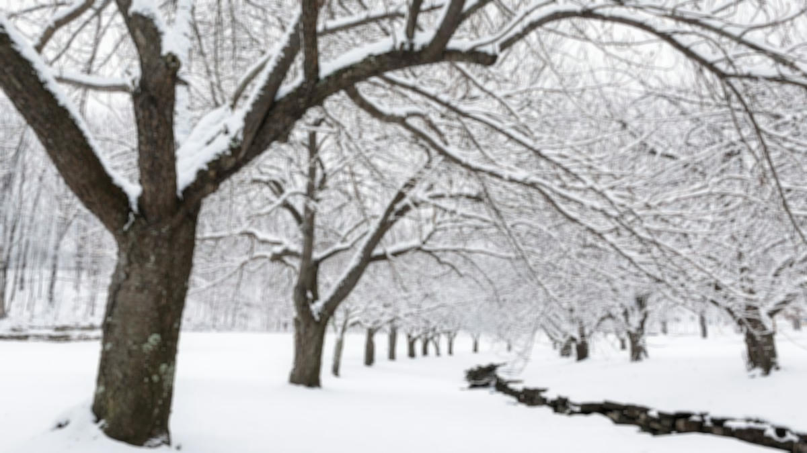

# Blur filter

This does what you think it does. Blurring works by taking the average value of adjacent pixels.

Original                 | Filtered
-------------------------|------------------------------------
 | 
 | 