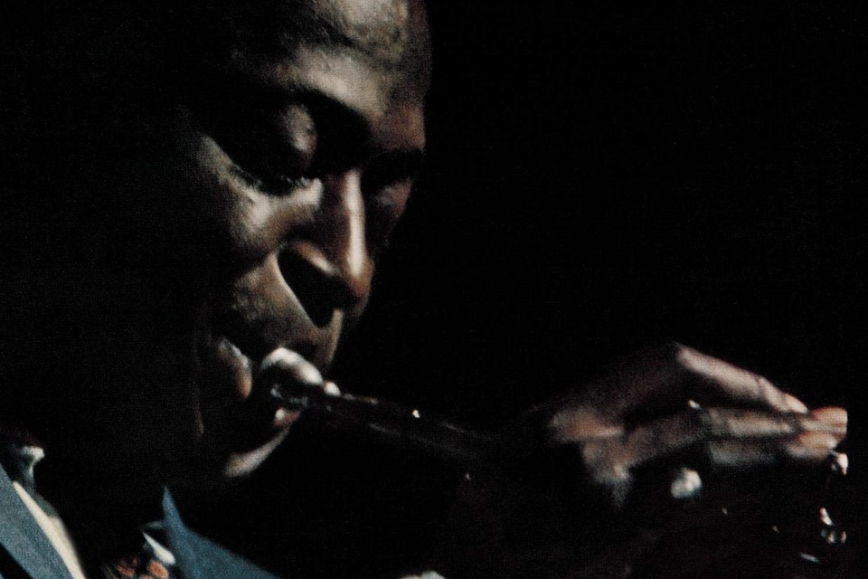

# Kuwahara filter

The [Kuwahara filter](https://en.wikipedia.org/wiki/Kuwahara_filter) is a smoothing filter that assigns pixel values based on the values of the adjacent quadrant with the lowest standard deviation. As a result, the image becomes more stylised, as if it were painted.

Original                 | Filtered
-------------------------|------------------------------------
 | 
 | 