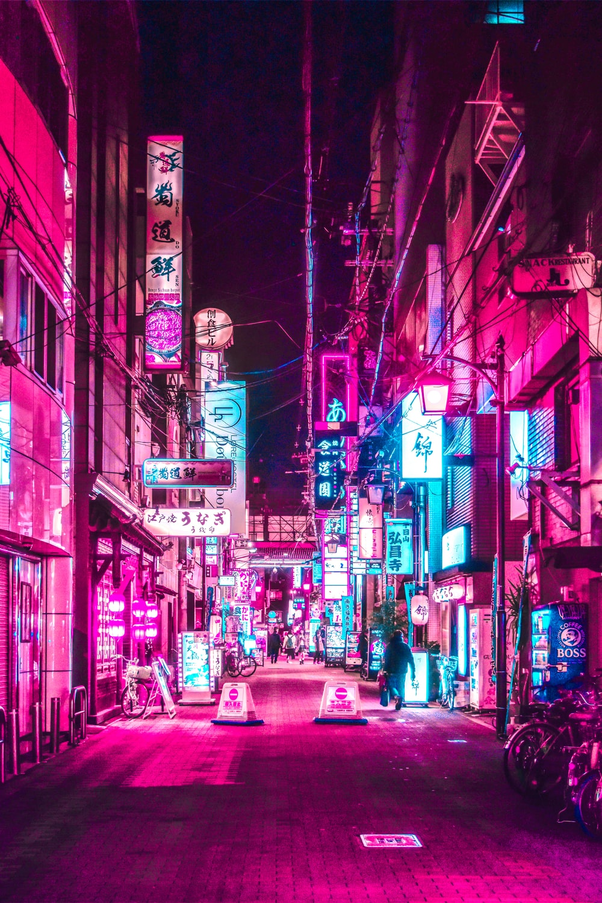
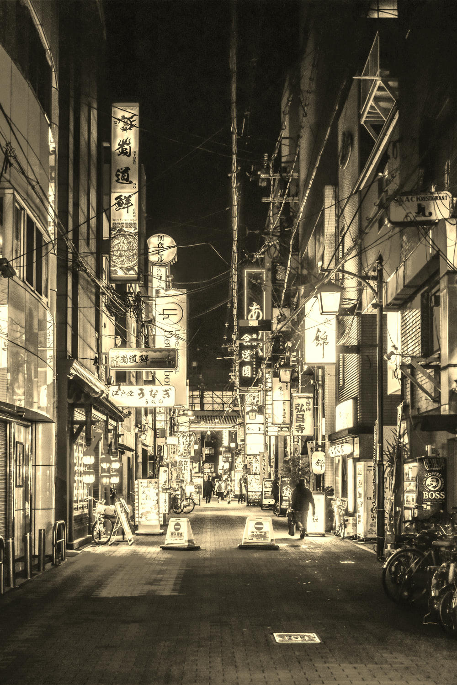

# Sepia Tone

[Sepia](https://en.wikipedia.org/wiki/Sepia_(color)) toning was originally a chemical process used to preserve images. The preservation element of this technique has given rise to its "antique" vibe in modern times.

Original                 | Filtered
-------------------------|------------------------------------
 | 
 | 