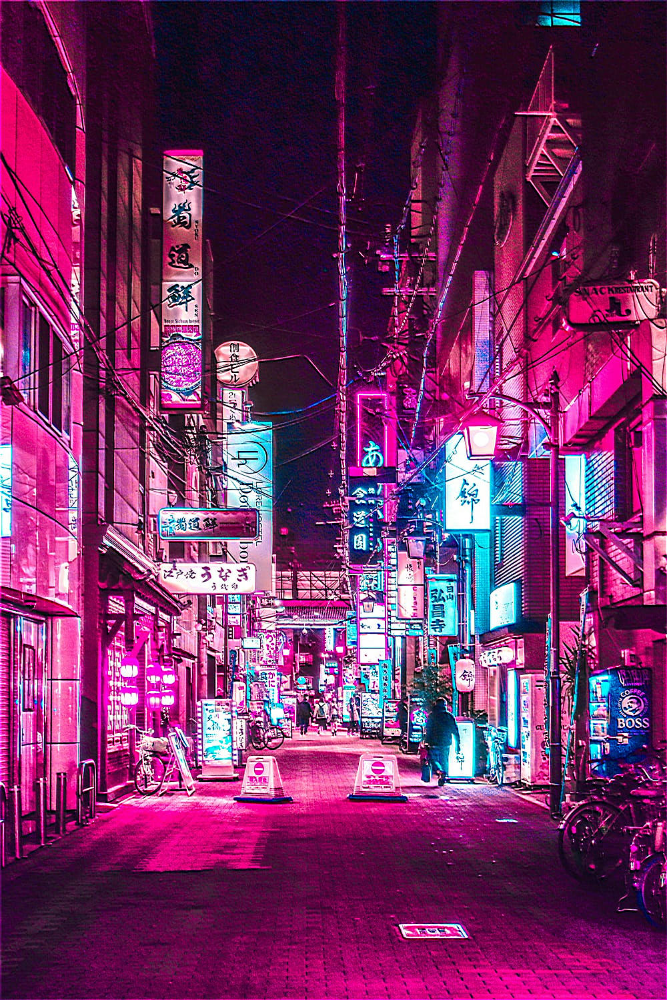
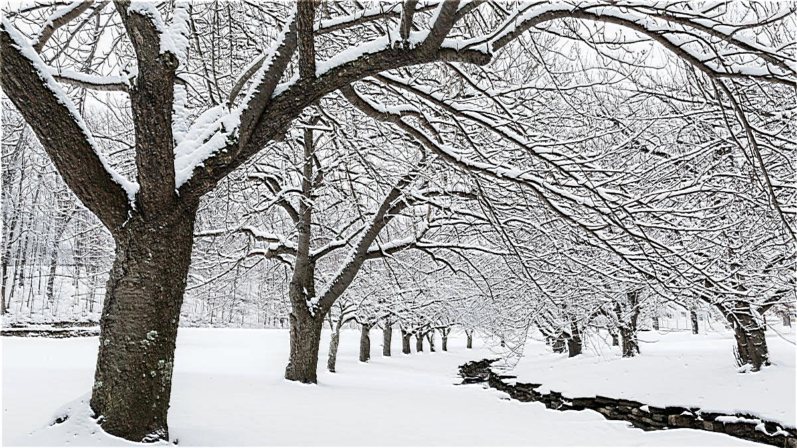

# Unsharp Masking

[Unsharp masking](https://en.wikipedia.org/wiki/Unsharp_masking) is a technique used to sharpen images. A blurred version of the input image is used as a mask, which creates a sharper image when combined with the original. Gaussian blur is used to create the mask.

Original                 | Filtered
-------------------------|------------------------------------
 | 
 | 
